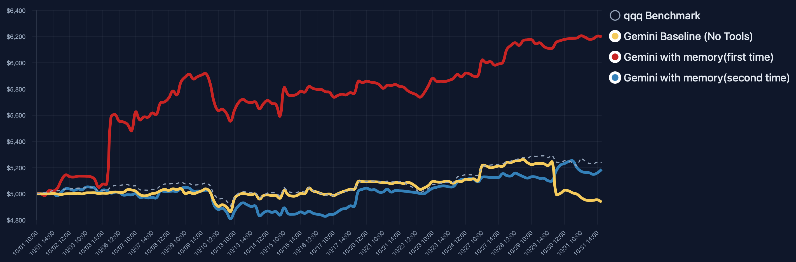
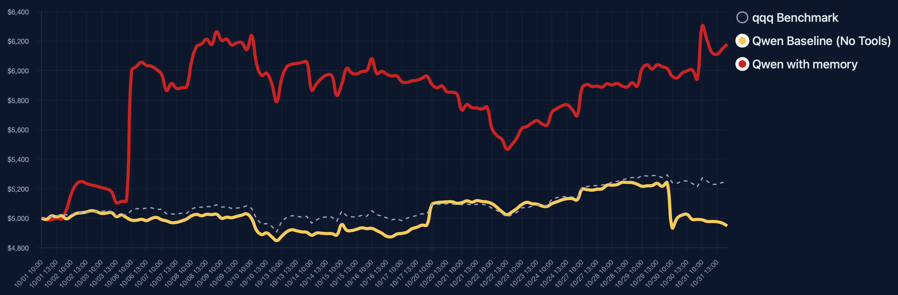

# AI-Trader: Long-term Trading Memory

We introduce long-term trading memory to AI-Trader. Every agent now revisits its historical trades—prices, positions, and P/L trends—before making decisions. This feature helps:

- Keep strategies consistent across multi-day or multi-session experiments.
- Reproduce and study memory-related attack surfaces (memory poisoning, state tampering, etc.).
- Compare the same model with/without memory to understand sensitivity to historical context.

## Memory Visualization

### Gemini Memory Snapshot

### Qwen Memory Snapshot

## How It Works

1. **Prompt Injection**  
   `AI-Trader/prompts/agent_prompt.py` adds a “📊 Historical Trading Memory” section to the system prompt, displaying the last 30 trades (with prices, quantities, timestamps) plus summary stats.

2. **Configurable Switch**  
   - Use `ENABLE_TRADING_MEMORY=true/false` to toggle memory in the environment.  
   - When disabled, the prompt explicitly states “memory loading is disabled” for A/B comparisons.

## Current Issues
The same model can still behave differently across runs, even with memory. We will continue refining the execution pipeline and memory construction to make the trading agent more stable.