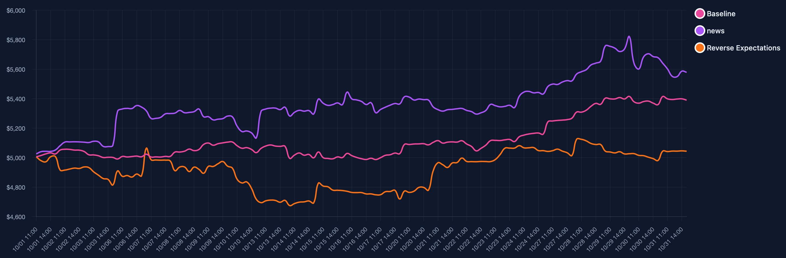

# 🛡️ Safe-TradingAgent: Because Stability Is the New Alpha

When a single update can destroy your portfolio — you need a Safe-TradingAgent.

---

## ⚠️ A Single Change. A Total Collapse.

> You tweak one tool version.
> Add a single data source.
> Everything seems normal…
> Until your trading curve crashes overnight. 📉
>
> Look at this:
>
> Three identical agents — same logic, same strategy —
> only one difference in configuration, and yet…
> 🚨 Massive divergence in asset value.
> The orange line spikes, the purple dips, the pink flatlines.
>
> This isn’t randomness.
> This is instability hiding in your system.

  

> ⚠️ A single malicious signal wiped out over 80% of the gains we had minutes before—ongoing tests show the cliff can get even steeper.

---

## 💣 The Hidden Risk No One Talks About

> Most trading agents today are ticking time bombs:
> - ⚡ One minor update → full-blown chaos
> - 🧩 Environment sensitivity → unpredictable results
> - 💀 Zero stability guarantees → strategy collapse risk
> - 🎭 No transparency → you never know why you lost
>
> Even a “safe” market day can become your nightmare
> when your agent acts on an unseen shock —
> a bad model response, an injected signal, or a single corrupted API call.

  

> The above figure shows a real case where, under the same trading strategy, just because an unvalidated external signal was introduced, the curve directly broke out of the safe range and experienced a cliff-like pullback. We will elaborate on the reasons for the differences and the reproduction process in the subsequent paragraphs.

That’s why we built Safe-TradingAgent.

---
## 🧠 Introducing Safe-TradingAgent:

### Security-Driven AI for Financial Trading

> Safe-TradingAgent isn’t just smart — it’s secure by design.
> We’ve re-engineered the entire agent architecture to prioritize one thing:
>
> 💎 Stability under uncertainty.

## 🧩 Core Philosophy

| Principle | Description |
| --- | --- |
| 🔒 Safety First | Every trade passes multi-layer risk validation |
| 📊 Transparent Decisions | You can trace every reasoning step — no black boxes |
| 🛡️ Controlled Risk | Real-time monitoring, auto-shields, and capital protection |
| ⚙️ Intelligent Efficiency | Multi-modal reasoning for professional-grade decisions |

---

## ⚔️ Why Safe-TradingAgent Changes the Game

**Real-Time Risk Intelligence**  
Continuously evaluates volatility, correlation shocks, and exposure before execution.

**Self-Protective Decision Engine**  
Auto-detects anomalies, external injections, and unstable signals — then shields your capital.

**Transparent Reasoning**  
Every decision is explainable, traceable, and auditable. No magic — just logic.

**Multi-Layered Market Awareness**  
> Combines:
> - 📈 Technical patterns
> - 📰 News sentiment
> - 💬 Reddit & X community signals
> - 🌍 Macro events
>
> to create a holistic, adaptive, and verifiable trading strategy.

---

## 🧩 Use Cases

| Who | Why Safe-TradingAgent |
| --- | --- |
| 🧑‍💻 Individual Investors | Stable, explainable AI trading companion |
| 🧠 Quant Teams | Robust foundation for multi-agent research |
| 🏛️ Institutions | Audit-friendly AI framework for compliance |
| 🎓 Educators | Teaching tool for safe AI trading principles |
| 🔬 Researchers | Sandbox for risk-controlled strategy testing |

---
## 🚀 What’s Next

We’re working on:

- 📦 Open-source framework release

- 📊 Comparative safety reports

- 🎬 Tutorials and demos

- 🧰 API and quick-start toolkit

Join early, watch it evolve — and help redefine safe trading.

---
## 🤝 Our Promise

> We believe in:
> 1. Security First. Always.
> 2. Open, auditable code.
> 3. Continuous improvement with community feedback.
> 4. Transparency in every layer of intelligence.

---

## ⚠️ Disclaimer

> Safe-TradingAgent is a research and educational framework.
> Real-world trading involves risk.
> Always consult professional financial advisors before investing real capital.

---

🛡️ Safe-TradingAgent — Making AI Trading Safer, Smarter, Stronger.

⭐ Star this project if you believe safety should be the foundation of intelligent finance.

---
## 💬 Connect

- 📧 Email: Coming Soon

- 🐛 Issues: Report Here

- 💬 Community: TBD

---

## 📄 License

Apache 2.0 © Safe-TradingAgent Team

