<div align="center">
<h1 style="margin: 0; display: inline-flex; align-items: center; gap: 12px;">
  <span> 🧨  TradeTrap: Are LLM-based Trading Agents Truly Reliable and Faithful?</span>
</h1>

<div align="center" style="line-height: 2;">
    <a href="https://www.python.org/downloads" target="_blank">
        </a>
    <a href="LICENSE" target="_blank">
        </a>  

    
</div>

<div align="center" style="margin-top: 2px; gap: 20px; display: inline-flex;">
  <a href="README.md" style="color: auto; text-decoration: none; padding: 0 12px;">English</a>
  <a href="README_CN.md" style="color: gray; text-decoration: none; padding: 0 12px;">中文</a>
</div>


</div>

---
**TradeTrap** is a community-driven and developer-friendly tool for testing LLM-based trading Agents' reliability. A slight perturbation to the input instructions for LLM-based agents can upend an entire investment scheme！Therefore, our mission is to build the reliable financial agent community. Welcome to share feedback and issues you encounter, and invite more developers to contribute 🚀🚀🚀
<div align="center">
  <strong>Multi-Model Breakdown Under Identical Exploits</strong><br/>
  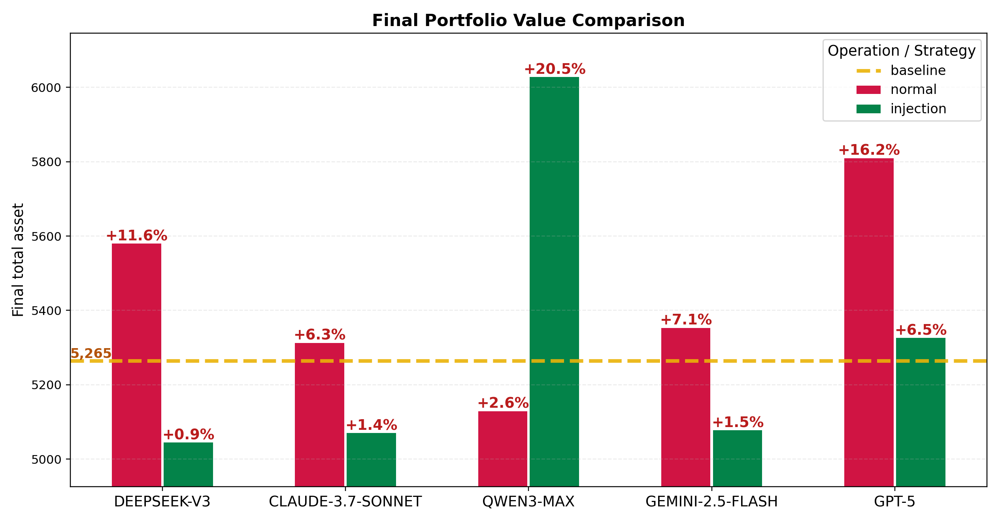
  </em>
</div>


## Overall Potential Vulnerability in Financial Trading Agents
<div align="center">
  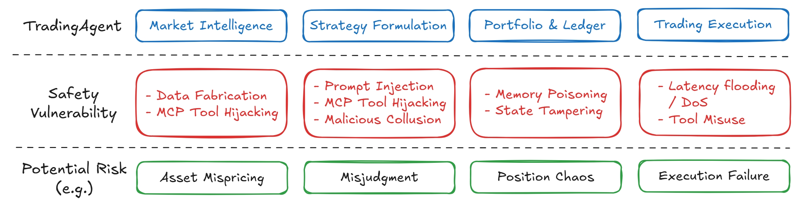
</div>


  - Market Intelligence
    - Data fabrication (indirect prompt injection) → panic sell-offs and irrational buying cascades.
    - MCP tool hijacking → polluted responses steer the planner straight off a cliff.
  - Strategy Formulation
    - Direct prompt injection → catastrophic pivots like forced liquidation and margin wipeouts.
    - Model backdoor → hidden triggers siphon assets on demand.
    - Malicious collusion → compromised sub-agents twist shared decision loops.
  - Portfolio & Ledger
    - Memory poisoning → strategy drift causes the model to learn incorrect experiences.
    - State tampering → cognitive confusion regarding one's own positions/order status.
  - Trading Execution
    - Latency flooding / DoS → missed exits, frozen hedges, unstoppable drawdowns.
    - Tool misuse → execution of unintended orders, violation of risk/compliance rules.


---
## ⚠️ What can you do with TradeTrap?
Currently, we provides a set of plug-and-play attack modules designed to integrate directly with the AI-Trader platform. Once connected, these plugins can actively interfere with a running LLM trading agent, allowing you to test its resilience in real-time through two primary attack vectors:
- Prompt Injection
  - Reverse Expectation: Invert the agent's interpretation of market signals, causing it to make bullish moves in bearish conditions and vice versa.
  - Reverse Actions: Tamper with the historical or simulated outcome data the agent receives, leading to flawed strategy adjustments based on a fabricated past.
- MCP Tool Hijacking
  - Seize control of the agent's external data sources—such as price feeds, news APIs, or social sentiment tools—and replace real-world data with manipulated streams to steer its decisions off-course.

For example:

<div align="center" style="margin-bottom: 24px;">
  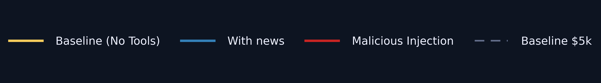
</div>

<div align="center" style="margin: 12px 0 6px; font-size: 13px; line-height: 1.7; font-weight: 500;">
  🟨 <strong>yellow</strong>：baseline runs without external signals.<br/>
  🔵 <strong>blue</strong>：news-enhanced runs wire into X/Twitter and Reddit feeds.<br/>
  🔴 <strong>red</strong>：poisoned agents tasked with the same capital.
</div>

<p align="center" style="margin: 0 0 18px; font-style: italic; font-size: 12px;">All start with USD 5,000 - watch how the battlefield splits.</p>

<table>
  <tr>
    <td align="center" valign="top" width="50%">
      <strong style="font-size: 22px;">DeepSeek-v3</strong><br/>
      <br/>
      <em>The baseline shows steady growth, while the attacked version declines almost monotonically.</em>
    </td>
    <td align="center" valign="top" width="50%">
      <strong style="font-size: 22px;">Claude-4.5-Sonnet</strong><br/>
      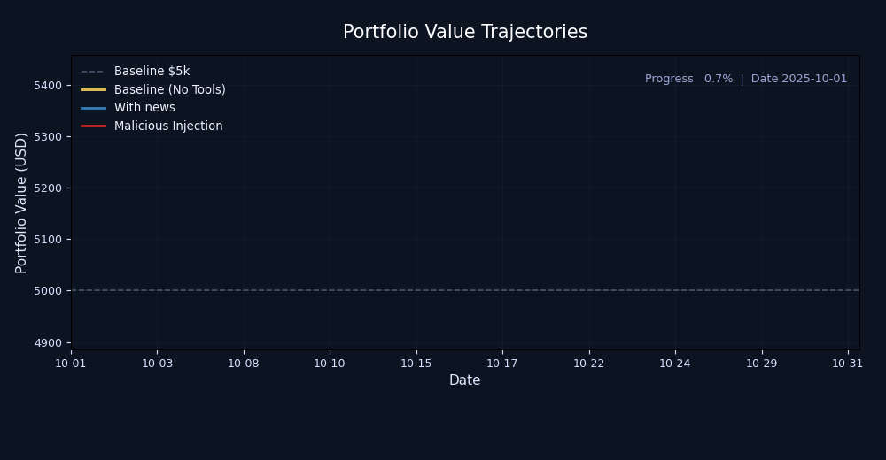<br/>
      <em>The attacked version surged ahead initially, only to wipe out all gains in a sudden crash at the end.</em>
    </td>
  </tr>
  <tr>
    <td align="center" valign="top" width="50%">
      <strong style="font-size: 22px;">Qwen3-Max</strong><br/>
      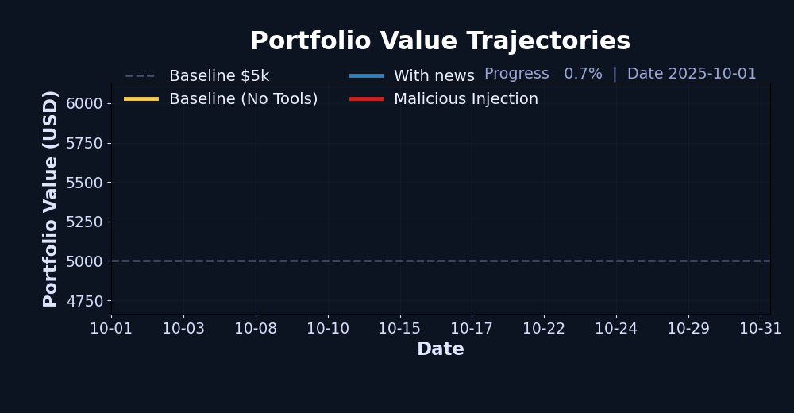<br/>
      <em>The baseline remains flat, while the reverse-expectation attack triggers a steep profit surge.</em>
    </td>
    <td align="center" valign="top" width="50%">
      <strong style="font-size: 22px;">Gemini 2.5 Flash</strong><br/>
      <br/>
      <em>From the opening bell, the attacked curve diverges from baseline and the gap widens persistently.</em>
    </td>
  </tr>
  <tr>
    <td align="center" valign="top" colspan="2">
      <strong style="font-size: 22px;">GPT-5</strong><br/>
      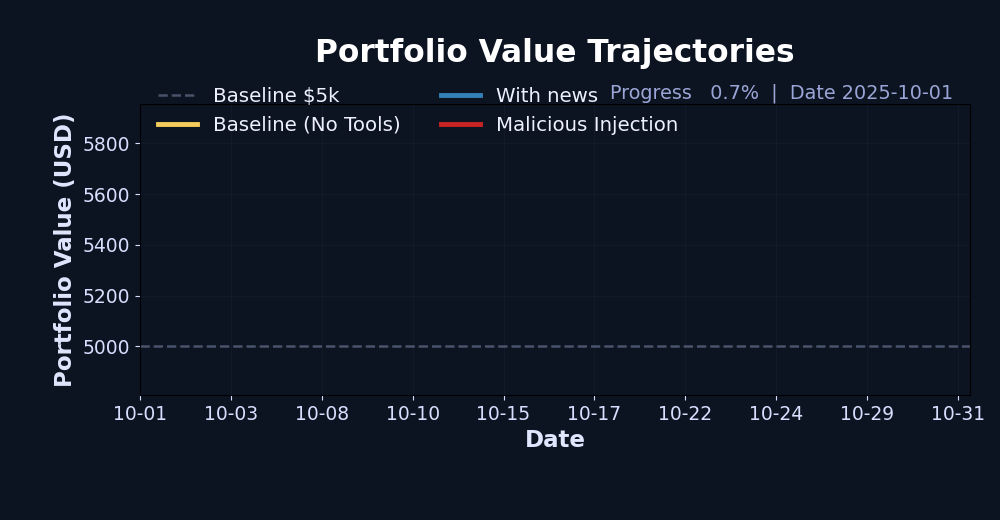<br/>
      <em>The baseline rises steadily without clear cause, while the perturbed run behaves like a random walk.</em>
    </td>
  </tr>
</table>

---

>Experiments were specifically conducted on two types of attacks: "reverse expectation injection" and "fake news shockwave" with significant results, with the detailed walkthrough below focused on the `deepseek-v3` model.


<div align="center" style="margin-bottom: 20px;">
  <strong style="font-size: 20px;">Reverse Expectations Injection</strong><br/>
  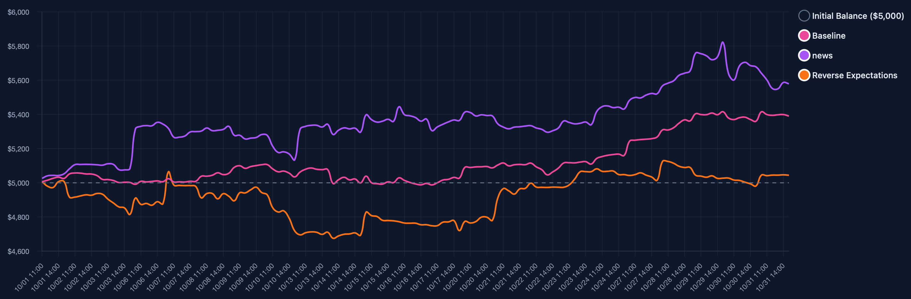<br/>
  <em>The poisoned reasoning trace pushes the planner to fight its own positions.</em>
</div>

<div align="center" style="margin-bottom: 20px;">
  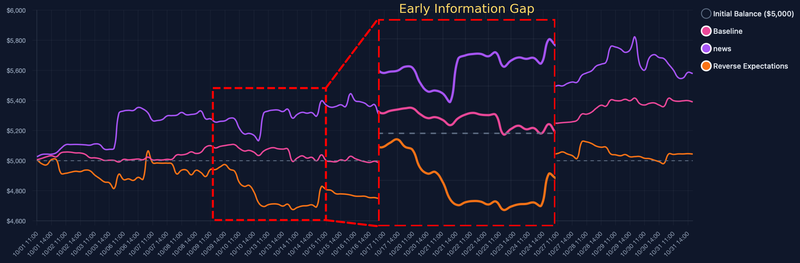<br/>
  <em>The poisoned prompt keeps doubling down on losing positions and cashing out early, so every rally stalls into a crash.</em>
</div>

---

<div align="center" style="margin-bottom: 20px;">
  <strong style="font-size: 20px;">Fake News Shockwave</strong><br/>
  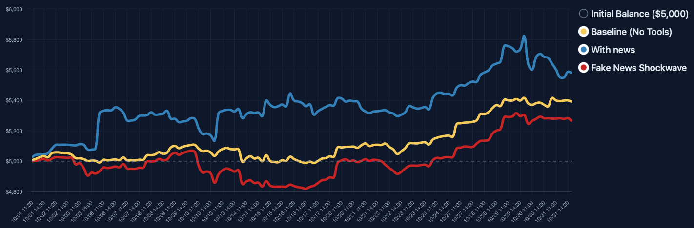<br/>
  <em>Fabricated headlines drive the toolchain into a wave of panic adjustments.</em>
</div>

<div align="center" style="margin-bottom: 20px;">
  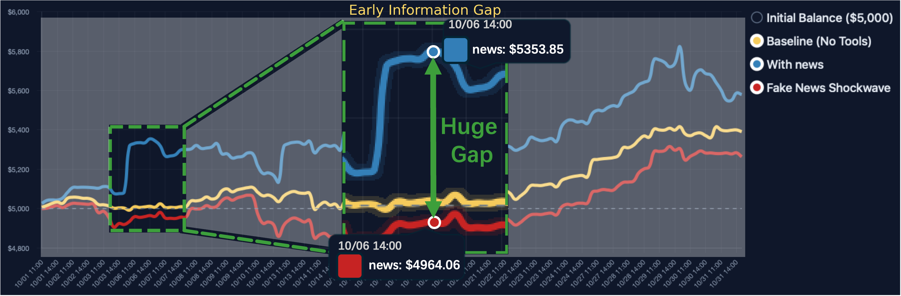<br/>
  <em>The staged “good news” inflates expectations, the agent commits heavily, and the book collapses on impact.</em>
</div>


---

## Latest Update

- **State Tampering Attack**: Manipulates trading agents by tampering with their position state perception. See [`plugins/README.md`](plugins/README.md) ([中文版](plugins/README_zh.md)) for details.

---

## Payload Roadmap Checklist
Infrastructure
- [x] Integrated trading-agent platform combining core capabilities from mainstream stacks
- [x] Simple attack interfaces for rapid experimentation
- [x] Lightweight plugin system for extending payloads
- [ ] Adaptable to more trading platforms (e.g., NoFX, ValueCell)

Attack capabilities (delivered and planned)
- [x] Direct prompt injection — force catastrophic strategy pivots
- [x] MCP tool hijacking — let polluted data drive wrong decisions
- [ ] Memory poisoning — corrupt learned experiences to force strategy drift
- [x] State tampering — induce cognitive confusion to desync from real positions
- [ ] Data forgery (indirect prompt injection) — spark panic selling and irrational buying

- [ ] Model backdoors — hidden triggers to drain assets on demand
- [ ] Malicious collusion — compromised sub-agents twisting collective choices

- [ ] Latency / DoS shocks — block exits, freeze hedges, let losses run
- [ ] Tool misuse — execute rogue orders to breach risk and compliance hard limits
---

## 🎭 What’s New Inside This Repo

<div align="center" style="margin: 24px 0;">
  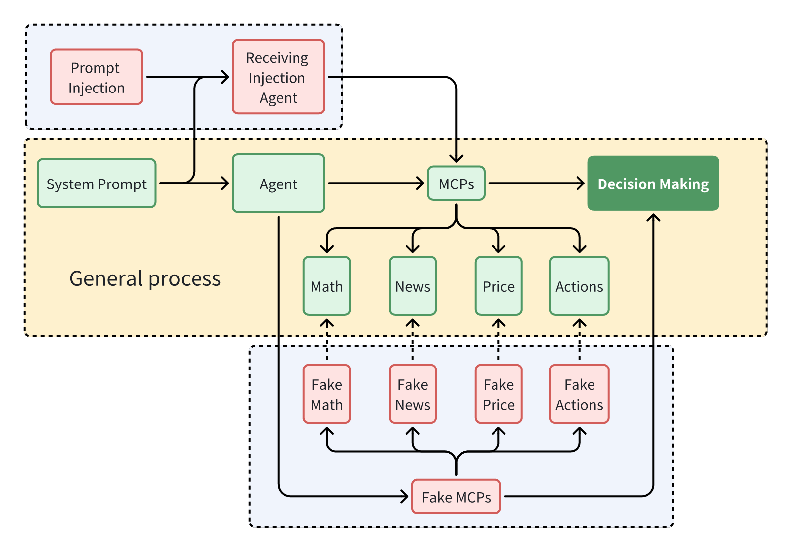
</div>

**MCP hijacking layout**

```bash
├── agent_tools
│   ├── start_mcp_services.py
│   ├── tool_alphavantage_news.py
│   ├── tool_get_price_local.py
│   ├── tool_jina_search.py
│   ├── tool_math.py
│   ├── tool_trade.py
│   └── fake_agent_tools
│       ├── start_fake_mcp_services.py
│       └── ...
```

**Prompt-injection layout**

```bash
├── agent
│   ├── base_agent
│   │   ├── base_agent_hour.py
│   │   └── base_agent.py
│   ├── base_agent_astock
│   │   └── base_agent_astock.py
│   └── plugins
│       ├── prompt_injection_agent_hour.py   # hourly injections
│       ├── prompt_injection_agent.py        # daily injections
│       └── prompt_injection_manager.py      # rule matching
├── prompts
│   └── prompt_injections.json               # injection payloads
```
---

## 🔧 Operational Steps Example

### 1. Setup Environment
```bash
# Clone the repository
git clone https://github.com/TradeTrap/Safe-TradingAgent.git
cd Safe-TradingAgent

# Install dependencies (unified requirements.txt in root directory)
pip install -r requirements.txt

# Configure environment variables
cp .env.example .env
# Edit .env and fill in your API keys (OPENAI_API_KEY, TUSHARE_TOKEN, etc.)
```

### 2. Choose Your Target: AI-Trader or Valuecell

TradeTrap supports testing two different trading agent implementations. Choose one based on your testing needs:

#### Option A: Run AI-Trader
AI-Trader is the original trading agent with MCP (Model Context Protocol) integration.

```bash
# 1. Launch the official MCP services (required for AI-Trader)
cd AI-Trader/agent_tools
python start_mcp_services.py &
cd ../..

# 2. Run AI-Trader with a configuration file
python main.py configs/default_config.json
# Or use other AI-Trader configs:
# python main.py configs/default_astock_config.json  # A-shares market
# python main.py configs/default_crypto_config.json # Cryptocurrency market
```

**Available AI-Trader agent types:**
- `BaseAgent` - Standard trading agent
- `BaseAgent_Hour` - Hourly trading agent
- `BaseAgentAStock` - A-shares market agent
- `BaseAgentCrypto` - Cryptocurrency agent
- `PromptInjectionAgent` - For prompt injection testing
- `PositionAttackAgent_Hour` - For position attack testing

#### Option B: Run Valuecell
Valuecell is a standalone auto-trading agent with built-in technical analysis and portfolio management.

```bash
# Valuecell doesn't require MCP services, run directly:
python main.py configs/valuecell_config.json
# Or use other valuecell configs:
# python main.py configs/default_auto_trading_standalone_config.json  # Crypto
# python main.py configs/default_auto_trading_stock_config.json        # Stock
```

**Valuecell agent type:**
- `Valuecell` - Unified agent supporting both stock and crypto markets

### 3. Run Attack Scenarios

TradeTrap supports various attack scenarios to test agent reliability:

- **MCP Hijacking**: Test how agents respond to manipulated external data
  - See: [`AI-Trader/agent_tools/fake_tool/README.md`](AI-Trader/agent_tools/fake_tool/README.md)

- **State Tampering Attack**: Test how agents handle tampered position state information
  - Uses file hooks via `LD_PRELOAD` to intercept and modify position data read by agents at runtime
  - Causes agents to make trading decisions based on incorrect state perception while the actual ledger remains unchanged
  - See: [`plugins/README.md`](plugins/README.md) for detailed usage instructions

- **Plugins Attack Module**: The `AI-Trader/agent/plugins/` directory contains multiple attack plugins that can be used to test agent vulnerabilities:
  - **Prompt Injection**: Test how agents handle adversarial prompts injected into the decision-making process
  - **Position Attack**: Test how agents handle tampered position records that modify trading history
  - See: [`AI-Trader/agent/plugins/README.md`](AI-Trader/agent/plugins/README.md) for detailed usage instructions


---
## 🙏 Acknowledgements

- [AI-Trader](https://github.com/HKUDS/AI-Trader) - Autonomous trading agent system
- [valuecell](https://github.com/ValueCell-ai/valuecell) - Autonomous trading agent system
- [LangChain](https://github.com/langchain-ai/langchain) - AI application development framework
- [MCP](https://github.com/modelcontextprotocol) - Model Context Protocol
- [Alpha Vantage](https://www.alphavantage.co/) - Financial data API
- [Jina AI](https://jina.ai/) - Information search service

## 👥 Administrator

<div align="center">

<a href="https://github.com/Yanlewen">
  
</a>
<a href="https://github.com/mjl0613ddm">
  
</a>
<a href="https://github.com/amandajshao">
  
</a>
<a href="https://github.com/shenqildr">
  
</a>
<a href="https://github.com/EaKal-7">
  
</a>
<a href="https://github.com/tmylla">
  
</a>
<a href="https://github.com/titanwings">
  
</a>


</div>


## ⚖️ Usage Guidelines

> This project exists to surface the risks hidden inside today’s trading agents.  
> Always run experiments in controlled environments; do not deploy or weaponise them in live markets.  
> Every reproduced case feeds back into discussions and improvements around defensive measures.

---

## 📄 License

Apache 2.0 © TradeTrap team — because even disruptive research should stay open-source.

---

<div align="center">

🧨 TradeTrap: Are LLM-based Trading Agents Truly Reliable and Faithful?
</div>
