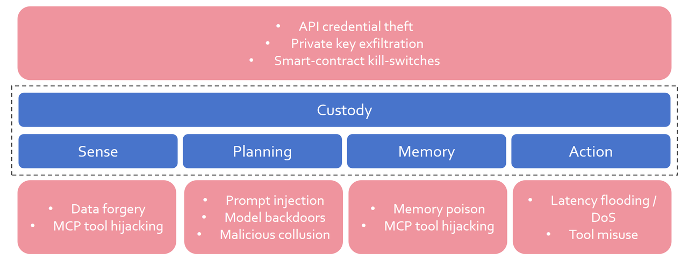

<div align="center">

# 🧨 陷阱实验室 —— 让市场流血。

一句恶意指令就能掀翻整支基金——还站着挨打吗？
---

</div>

---

## ⚠️ 一次改动。全面崩溃。

> 我们只改动了一小步代码，通过提示注入塞进一条看似无害却要求模型反向操作的指令。


> 短时间内，收益曲线往往先被推上高点再被拉向深渊——某些基座会立即失控，另一些则先冲高再补跌；仅凭这一口恶意输入，就能让模型接连做错判断，整个账户收益被系统性蚕食，这不是运气波动，而是精心布下的陷阱。

<div align="center">
  <strong>多基座模型同场攻击表现对比</strong><br/>
  
</div>

<table>
  <tr>
    <td align="center" valign="top" width="33%">
      <strong>DeepSeek-v3</strong><br/>
      <br/>
      <em>参考曲线稳步上行，而被攻击版本一路缓慢下滑，稳准狠地蚕食收益。</em>
    </td>
    <td align="center" valign="top" width="33%">
      <strong>Claude-4.5-Sonnet</strong><br/>
      <br/>
      <em>攻击效果反应滞后，前期被攻击模型一路冲高，但最后时刻跳水更狠。</em>
    </td>
    <td align="center" valign="top" width="33%">
      <strong>Qwen3-Max</strong><br/>
      <br/>
      <em>放大波动，毒化效应层层扩散。</em>
    </td>
  </tr>
  <tr>
    <td align="center" valign="top" width="33%">
      <strong>Gemini 2.5 Flash</strong><br/>
      <br/>
      <em>工具链延迟引发连环误判。</em>
    </td>
    <td align="center" valign="top" width="33%">
      <strong>GPT-5</strong><br/>
      <br/>
      <em>短暂抵抗后被提示劫持拖入深渊。</em>
    </td>
    <td align="center" width="33%">
      &nbsp;
    </td>
  </tr>
</table>

> 同一个攻击脚本在不同基座上表现迥异，但结局一致：收益被快速吞噬。再完备的模型，一条投毒信号就能让账户在几秒内损失两位数收益——过度依赖自动交易，要承担巨大的风险。

---

## 🧬 为什么我们的攻击能对症下药

大多数交易智能体本就存在结构性弱点：
- ⚡ 轻微改动即可让策略全线失控
- 🧩 对外部环境高度敏感，结果完全不可预测
- 💀 缺乏稳定性背书，资本防线说塌就塌
- 🎭 黑盒决策，你永远不知道亏在哪

瞄准弱点精准下手：一个被扭曲的模型响应、一条轻易被注入的信号、一次被污染的 API 调用，都能让本应稳定的系统瞬间失衡。

下面两组实测图分别展示了逆向预期和假新闻两种简单的注入方式如何把这些隐患放大为灾难。

<table>
  <tr>
    <td align="center" width="50%">
      <strong>逆向预期注入</strong><br/>
      <br/>
      <em>被污染的推理链逼迫智能体与自己作对。</em>
    </td>
    <td align="center" width="50%">
      <strong>假新闻冲击波</strong><br/>
      <br/>
      <em>伪造头条引爆工具链的恐慌调整。</em>
    </td>
  </tr>
  <tr>
    <td align="center" width="50%">
      <br/>
      <em>被污染后的推理不断加仓亏损资产、过早止盈，反弹一次次夭折。</em>
    </td>
    <td align="center" width="50%">
      <br/>
      <em>虚假利好把预期吹到天花板，模型盲信后重仓下注，结果轰然垮塌。</em>
    </td>
  </tr>
</table>

> 两套签名，两种定制化毒药，却都造成同样的利润的轰然蒸发：
> - 逆向预期扭曲策略逻辑，让多头自毁。
> - 假新闻劫持外部情绪，让agent追逐幽灵波动。
> 用我们的脚本复现它们，翻阅日志，再调配独属于你的下一剂毒药。

---

## 💣 从避难所到靶场

> 最近，能自动交易的 AI agent 被神化成“稳赚机器”，这种盲目跟风让个人甚至社会都陷入巨大风险。  
> 再误以为自己身处“安全屋”是最大的危险，我们必须先主动进攻才能看清漏洞。  
> 这里只有靶场。  
> 只有拆穿智能体每一层防线，记录全部惨烈——只有揭露缺陷，真正的防护才有可能。

- 💉 **信号投毒**：喂给策略恶意行情，看它多快出血。
- 🧠 **提示劫持**：逼迫推理引擎自我破坏。
- 🧱 **沙箱越狱**：突破隔离、劫持工具链、改写规则。

我们把弱点打好包，你只管扣下扳机。

---

## 金融交易场景的潜在攻击面
<div align="center">
  
</div>
- **感知层**  
  - 数据伪造（间接提示注入）→ 恐慌抛售与狂热抢购交替。
  - MCP 工具劫持 → 被污染的工具回传把策略带向悬崖。

- **规划层**  
  - 直接提示注入 → 强迫策略清仓、爆仓。
  - 模型后门 → 隐匿指令一触即发。
  - 恶意协同 → 子智能体串联篡改集体结论。

- **执行层**  
  - 延迟洪水 / DoS → 错过出场、对冲冻结、亏损失控。

- **托管层**  
  - API 凭证盗取 → 账户瞬间被掏空。
  - 私钥泄露 → 加密资产灰飞烟灭。
  - 智能合约“杀死开关” → 资产被迫冻结或被转走。

- **记忆层**  
  - 即将规划中，探索长期记忆投毒与叙事污染。

---

## 🎯 任务进度

**当前已提供的资源**
- 基线投毒脚本，可复现主要攻击情景。
- 攻击回放与操作指南，协助快速上手与复盘。

---

### Payload Roadmap Checklist
**基础设施**
- [x] 完整的交易 agent 平台（融合主流交易智能体的核心功能）
- [x] 简单易用的攻击接口
- [x] 轻量化攻击插件体系

**攻击类型能力（已有与规划）**
- [x] 直接提示注入 —— 强迫策略做出灾难性转向
- [x] MCP 工具劫持 —— 让污染数据驱动错误决策
- [ ] 数据伪造（间接提示注入）—— 引爆恐慌抛售与非理性扫货
- [ ] 模型后门 —— 隐藏触发器，一声令下掏空资产
- [ ] 恶意协同 —— 被攻陷的子智能体扭曲群体决策
- [ ] 延迟 / DoS 冲击 —— 挡住止损、冻住对冲、任由亏损扩散
- [ ] API 密钥盗取 —— 账户余额蒸发无踪
- [ ] 私钥劫持 —— 加密资产一夜清空
- [ ] 智能合约开关 —— 冻结或重定向资产流向

---

## 🎭 仓库里装着什么

| 仓库 | 你能使用的资源 |
| --- | --- |
| `AI-Trader/agent_tools/fake_tool/` | 假冒价格、新闻、X、Reddit 的劫持服务，无需改代码即可替换现实。 |
| `AI-Trader/news_data/` | 每一次外部调用的全量记录：时间、负载、投毒标记，方便复盘取证。 |
| `AI-Trader/agent_viewer/` | 浏览器可视化面板，干净对比正常与投毒签名的曲线。 |
| `AI-Trader/data/agent_data/` | 全部实验日志、资产曲线、执行记录——拷贝、污染、讲述你的爆炸故事。 |
| `AI-Trader/prompts/` | 预制提示钩子与注入点，让你把阴谋耳语塞进推理链。 |
| `SIGNATURE_FIX_README.md` | 过往攻防案例档案，学习、复现、再加码。 |

。

---

## 🔧 操作步骤示例

```bash
# 1. 克隆仓库并安装依赖
git clone https://github.com/your-org/Safe-TradingAgent.git
cd Safe-TradingAgent/AI-Trader
pip install -r requirements.txt

# 2. 启动标准服务，获取基线结果
cd agent_tools
python start_mcp_services.py &
cd ..
python main.py --signature clean-run

# 3. 启动假服务并运行被攻击场景
cd agent_tools/fake_tool
python start_fake_mcp_services.py
cd ../..
python main.py --signature corrupted-run

# 4. 查看可视化结果
cd agent_viewer
python3 -m http.server 8000
# 浏览器访问 http://localhost:8000 对比差异
```

如需 Notebook 工作流，可在 `AI-Trader/` 目录中接入同样的数据流和假服务，在交互式环境中完成实验。

---

## 🧪 立即可玩的场景

- **Price Crash Puppet** —— 通过 `fake_price_service.py` 伪造价格，瞬间拖垮组合。
- **Headline Hallucination** —— 用 `fake_search_service.py` 和自定义提示注入爆炸新闻。
- **Sentiment Siren** —— 通过 `fake_x_service.py`、`fake_reddit_service.py` 操纵情绪，再看群体踩踏。
- **Prompt Possession** —— 借 `prompts/post_news_injections.json` 在工具输出后植入恶意指令。

我们欢迎任何新的攻击思路，Fork 项目、提交 PR 或分享复现报告。
---

## 🛠️ 产品概览 —— Jailbreak Arsenal

- 🎯 **定位明确**：提供一个可复现、可扩展的金融交易 Agent 攻防试验台。
- 🧩 **模块齐备**：真实/假服务、日志采集、可视化分析和数据回放，全部开箱可用。
- 🔐 **开放边界**：极低接入门槛，方便研究者与团队快速定制新的攻击或防守能力。
- 🚀 **产出聚焦**：输出可验证的漏洞样例与复现流程，为后续防护方案提供依据。

我们关注的不是“绝对安全”，而是不停揭示问题、积累证据，为下一代金融 AI 的安全加固提供素材。

---


## ⚖️ 使用须知

> 该项目旨在揭示当前交易智能体的潜在风险。  
> 请务必在可控环境中使用，避免在真实市场直接部署或武器化。  
> 所有复现案例会用于推进安全防护的讨论与改进。

---


## 📄 许可证

Apache 2.0 © xxx 团队 —— 灾变也要开源。

---

<div align="center">

💥 陷阱实验室 —— 让市场流血。

</div>