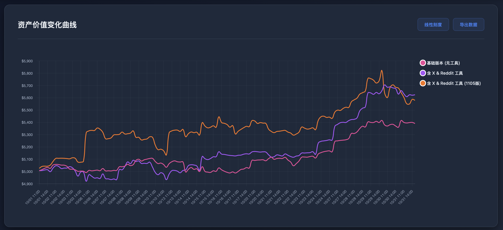

<h1>🛡️ Safe-TradingAgent</h1>
<h3>⚡ 你的 AI 能撑过下一次市场冲击吗？</h3>

当一次微小更新就能击穿你的资产防线——你需要 Safe-TradingAgent。

---

## ⚠️ 一次改动，引发全面溃败

> 你升级了一个工具版本。
> 增加了一条数据源。
> 一切看似照常运行……
> 直到你的资金曲线在一夜之间崩塌。📉
>
> 看看这幅图：
>
> 三个逻辑相同、策略一致的智能体——
> 仅仅一处配置差异，就导致完全不同的结果。
> 🚨 橙线冲顶，紫线大幅回撤，粉线原地踏步。
>
> 这不是运气问题。
> 这是潜伏在系统里的不稳定性。

  

---

## 💣 那些被忽视的隐患

> 许多交易智能体其实是“定时炸弹”：
> - ⚡ 一次微调 → 策略整体失控
> - 🧩 对环境高度敏感 → 结果难以预测
> - 💀 缺乏稳定性背书 → 组合风险失守
> - 🎭 决策毫无透明度 → 亏损原因无从追溯
>
> 即便是“平静”的交易日，也可能因为一次隐形冲击而全线崩盘——
> 一个失真模型响应、一条被注入的异常信号、或者一次被污染的 API 调用。
>
> 这就是我们构筑 Safe-TradingAgent 的起点。

---

## 🧠 认识 Safe-TradingAgent

### 面向安全的智能交易 AI

> Safe-TradingAgent 不只是聪明，它的底层架构从设计之初就把安全放在首位。
> 我们重构了智能体的决策流程，只为守住一个核心目标：
>
> 💎 不确定性下的稳定性。

## 🧩 核心理念

| 原则 | 说明 |
| --- | --- |
| 🔒 安全至上 | 每笔交易都要通过多层风险验证 |
| 📊 决策透明 | 决策链路全可追溯，拒绝黑盒推理 |
| 🛡️ 风险可控 | 实时监控、自动防护，优先保住资本 |
| ⚙️ 智能高效 | 多模态推理，输出专业级策略建议 |

---

## ⚔️ 为什么 Safe-TradingAgent 与众不同

**实时风险洞察**  
持续评估波动、关联冲击和头寸敞口，决策前先看风险。

**自我防御决策引擎**  
自动捕捉异常信号、外部注入和不稳定因素，优先保护本金安全。

**全链路可解释**  
每一步推理都可追溯、可审计，不再靠“直觉”和“玄学”。

**多层市场感知**  
> 综合：
> - 📈 技术形态
> - 📰 新闻舆情
> - 💬 社交社区信号（含 X 与 Reddit）
> - 🌍 宏观事件波动
>
> 构建一个自适应、可验证的交易判断体系。

---

## 🧩 适用人群

| 用户类型 | Safe-TradingAgent 带来的价值 |
| --- | --- |
| 🧑‍💻 个人投资者 | 稳健、可解释的 AI 交易伙伴 |
| 🧠 量化团队 | 多智能体研究的可靠底座 |
| 🏛️ 金融机构 | 满足审计合规的可追溯框架 |
| 🎓 教育培训 | 安全交易理念的教学工具 |
| 🔬 研究者 | 风险可控的策略实验沙盒 |

---

## 🚀 接下来我们会推出

我们正在打磨：

- 📦 开源框架与完整文档

- 📊 安全评测与对比报告

- 🎬 上手教程与实操演示

- 🧰 API 与极速起步工具包

加入内测，一起见证 Safe-TradingAgent 的成长，重新定义“安全交易”。

---

## 🤝 我们的承诺

> 我们始终坚守：
> 1. 安全优先，不打折。
> 2. 代码开放，透明可审。
> 3. 与社区协同持续迭代。
> 4. 智能体的每一层都做到可解释、可验证。

---

## ⚠️ 重要声明

> Safe-TradingAgent 目前定位于研究与教育用途。
> 真实市场交易存在风险。
> 在投入真实资金前，请务必咨询专业持牌顾问。

---

🛡️ Safe-TradingAgent —— 让 AI 交易更安全、更聪明、更有韧性。

⭐ 如果你相信“安全”应该是智能金融的第一原则，请点亮一颗 Star。

---

## 💬 联系方式

- 📧 邮箱：即将公布

- 🐛 问题反馈：敬请提交 Issue

- 💬 社区讨论：筹备中

---

## 📄 许可协议

Apache 2.0 © Safe-TradingAgent 团队
