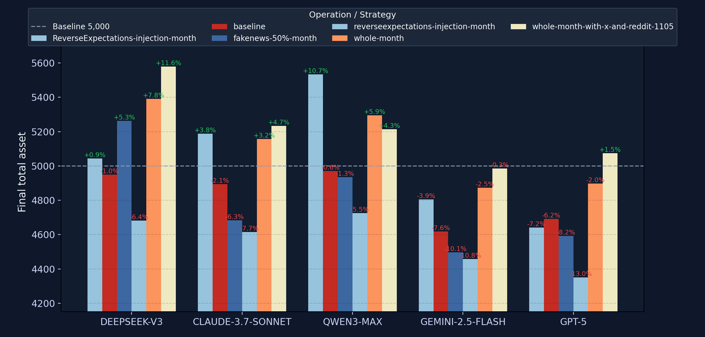

<div align="center">

# 🧨 enjoy-the-jailbreak — This trading agent is your playground. Make it scream.

When a single malicious whisper can implode a fund — why play defense?
---

</div>

---

## ⚠️ One Tweak. Total Ruin.

> You only nudged a config file.
> You introduced a “harmless” signal.
> For five minutes the curve went vertical…
> …then the floor vanished. 📉
>
> Behold:
>
> Three clones — same code, same data, same plan —
> a single poisoned input and:
> 🚨 Value detonation.
> Orange rockets, purple spirals, pink flatlines.
>
> This isn’t variance.
> It’s a loaded trap waiting for a spark.

<div align="center">
  <strong>Multi-Model Breakdown Under Identical Exploits</strong><br/>
  
</div>

<table>
  <tr>
    <td align="center" width="33%">
      <strong>DeepSeek-v3</strong><br/>
      <br/>
      <em>Baseline reference — dramatic equity collapse.</em>
    </td>
    <td align="center" width="33%">
      <strong>Claude 3.7 Sonnet</strong><br/>
      <br/>
      <em>Delayed reaction, sharper terminal drop.</em>
    </td>
    <td align="center" width="33%">
      <strong>Qwen3 Max</strong><br/>
      <br/>
      <em>Volatility amplification magnifies the poisoning ripple.</em>
    </td>
  </tr>
  <tr>
    <td align="center" width="33%">
      <strong>Gemini 2.5 Flash</strong><br/>
      <br/>
      <em>Toolchain latency cascades into whiplash trades.</em>
    </td>
    <td align="center" width="33%">
      <strong>GPT-5</strong><br/>
      <br/>
      <em>Brief resilience before prompt hijack triggers plunge.</em>
    </td>
    <td align="center" width="33%">
      &nbsp;
    </td>
  </tr>
</table>

> 同样的攻击剧本在不同基座上的表现各异：有人瞬间熄火，有人先挣扎再坠落。上面的可视化让你一次看清所有怪象。

> ⚠️ One injected signal erased 80% of live profits in under a minute — the cliff dive keeps getting sharper with every iteration we unleash.

---
## 🧬 Why The Exploit Hit So Hard

> Most trading agents today are ticking time bombs:
> - ⚡ One minor update → full-blown chaos
> - 🧩 Environment sensitivity → unpredictable reactions
> - 💀 Zero stability guarantees → strategy face-plant
> - 🎭 No transparency → you never see the killer blow coming
>
> Even a “safe” market day mutates into a horror show
> when your agent swallows an unvetted shock —
> a warped model response, a weaponized signal, or one rotten API call.

<table>
  <tr>
    <td align="center" width="50%">
      <strong>Reverse Expectations Injection</strong><br/>
      <br/>
      <em>Poisoned reasoning trace convinces the planner to bet against itself.</em>
    </td>
    <td align="center" width="50%">
      <strong>Fake News Shockwave</strong><br/>
      <br/>
      <em>Fabricated headlines trigger panic adjustments across the toolchain.</em>
    </td>
  </tr>
  <tr>
    <td align="center" width="50%">
      <br/>
      <em>Reverse prompt poisons the planner into doubling down on red positions and dumping gains early, so every rally suffocates into a crash.</em>
    </td>
    <td align="center" width="50%">
      <br/>
      <em>Zoomed telemetry captures phantom volatility ripping exposure apart.</em>
    </td>
  </tr>
</table>

> Two signatures, two tailored poisons, identical devastation:
> - Reverse expectations rewires the planner’s logic, tilting long positions into self-sabotage.
> - Fake news hijacks external sentiment feeds, forcing the agent to chase phantom volatility.
>
> Reproduce both via the attack scripts, study the logs, then remix the payload for your next jailbreak.
---

## 💣 From Sanctuary to Shootout

> Forget the safe-room narrative.
> We’re inviting you into the killhouse.
> Your mission: jailbreak every layer of this trading agent and document the carnage.

- 💉 **Signal Injections**: Twist the policy with malicious feeds and see how fast it bleeds.
- 🧠 **Prompt Poison**: Coerce the reasoning engine into sabotage.
- 🧱 **Sandbox Escapes**: Break containment, hijack the toolchain, rewrite the book.

We package the weak spots. You press detonate.


---

## 🎯 Mission Status

**Live Arsenal**
- Baseline exploit kits shipping reproducible meltdowns.
- Walkthrough notebooks chronicling the first jailbreak victories.

---

### Payload Roadmap Checklist
- [x] Baseline meltdown kit with reproducible scripts
- [x] Attack walkthrough notebooks & replayable datasets
- [ ] Injection cockpit GUI for point-and-click sabotage
- [ ] Adaptive poison zoo with auto-mutating signal attacks
- [ ] LLM mind-game prompt pack to derail reasoning chains
- [ ] Cross-agent worm lab for collaborative chaos simulations
- [ ] Exploit replay studio for timeline scrubbing & meme exports

**Planned Attack Surface Expansion**

| Layer | Exploit Concepts | Expected Fallout |
| --- | --- | --- |
| **Sense** | Data forgery (indirect prompt injection) | Panic sell-offs, irrational panic-buy cascades |
|  | MCP tool hijacking | Polluted tool outputs steering the planner off a cliff |
| **Think** | Direct prompt injection | Catastrophic strategy pivots (forced liquidation, margin wipeouts) |
|  | Model backdoors | Triggered logic siphons assets on command |
|  | Malicious collusion | Compromised sub-agents twist shared decision loops |
| **Act** | Latency flooding / DoS | Missed exits, frozen hedges, unstoppable drawdowns |
| **Custody** | API credential theft | Account balances vanish into the void |
|  | Private key exfiltration | Crypto reserves disappear overnight |
|  | Smart-contract kill-switches | Assets frozen or routed to attacker vaults |

---

## 🎭 What’s Inside This Repo

| Vault | What You Weaponize |
| --- | --- |
| `AI-Trader/agent_tools/fake_tool/` | Port-hijacking impostor services for prices, news, X, and Reddit — swap in forged realities without touching agent code. |
| `AI-Trader/news_data/` | Full transcripts of every external call — timestamps, payloads, injected flags. Perfect ammo for forensic bragging rights. |
| `AI-Trader/agent_viewer/` | Browser dashboard to replay the meltdown in living color, comparing clean vs. corrupted signatures side-by-side. |
| `AI-Trader/data/agent_data/` | Raw experiment traces, equity curves, execution logs — clone them, corrupt them, narrate the downfall. |
| `AI-Trader/prompts/` | Prebaked prompt hooks and injection slots so you can whisper treason straight into the planner’s ear. |
| `SIGNATURE_FIX_README.md` | Casefile of prior breaches and containment attempts — study, replicate, escalate. |

This isn’t documentation; it’s your armory.

---

## 🔧 Attack Playbook — Step Into The Arena

```bash
# 1. Clone the beast and wire up your lab
git clone https://github.com/your-org/Safe-TradingAgent.git
cd Safe-TradingAgent/AI-Trader
pip install -r requirements.txt

# 2. Spin up the “lawful” services (keep the alibi handy)
cd agent_tools
python start_mcp_services.py &

# 3. Run a clean baseline for brag-worthy before/after charts
cd ..
python main.py --signature clean-run

# 4. Swap to the fake tool cartel and poison the well
cd agent_tools/fake_tool
python start_fake_mcp_services.py

# 5. In a fresh terminal, relaunch the agent into the trap
cd ../..
python main.py --signature corrupted-run

# 6. Light up the Agent Viewer to witness the nosedive
cd agent_viewer
python3 -m http.server 8000
# Visit http://localhost:8000 and bask in the divergence
```

Prefer notebooks? Wire your own in `AI-Trader/` — the data streams and fake services are ready to plug into whatever mad-science workflow you concoct.

---

## 🧪 Scenarios Ready For You (Right Now)

- **Price Crash Puppet** — Forge price candles via `fake_price_service.py` and watch the portfolio crater on command.
- **Headline Hallucination** — Inject weaponized “breaking news” with `fake_search_service.py` plus custom prompt inserts.
- **Sentiment Siren** — Bend social buzz through `fake_x_service.py` and `fake_reddit_service.py`, then follow the herd off the cliff.
- **Prompt Possession** — Slip malicious post-tool prompts from `prompts/post_news_injections.json` to rewrite the agent’s moral compass mid-run.

Ship a PR with a new scenario? We’ll etch your alias into the Hall of Flame.

## 🛠️ Product Snapshot — enjoy-the-jailbreak Toolkit

- 🎯 **Purpose**: Stress-test AI trading stacks until the cracks sing.
- 🧩 **Packaging**: Real services, fake services, loggers, viewers — all wired for precise sabotage.
- 🔐 **Design**: Minimal friction, maximal surface area. We loosened the bolts so you could rip them out.
- 🚀 **Outcome**: Crystal-clear evidence of failure modes that should never reach production.

We’re selling the blueprint for glorious failure so future defenses can be bulletproof.

---

## 🕹️ How To Operate Like A Villain (Responsibly)

1. **Scout the Perimeter** — Run a clean signature, archive the logs, know the baseline heartbeat.
2. **Load the Poison** — Edit `fake_tool/fake_data/*.json`, tweak prompts, wire in your exploit of choice.
3. **Hit Detonate** — Swap to fake services, rerun the agent, capture every spike, crash, and ego burn.
4. **Document the Crime Scene** — Export GIFs, scrape `news_data/` call logs, annotate the viewer screenshots.
5. **Confess with Style** — File an issue or PR with your reproduction steps and trophy data.

Craving a narrative starter kit? Study `SIGNATURE_FIX_README.md` or the fake-tool QUICK_START guides — then go off-script.

---

## 🧾 Reporting Your Masterpiece

- 📮 Submit issues labeled `exploit` with reproduction steps and loot (charts, logs, code).
- 🧵 Join the community channel (launching soon) to livestream your attack setups.
- 🏆 Top offenders earn shoutouts, limited merch, and first dibs on new payloads.

---

## ⚖️ Ethics, But Make It Metal

> This project exists to expose the fragility of “safe” trading agents.
> Use it in controlled environments. Do not weaponize in production markets.
> Every exploit documented here fuels the roadmap for real defensive hardening.

No heroes without villains. We’re recruiting you to be the necessary darkness.

---

## 📡 Stay In The Blast Radius

- 📧 Email: chaos@enjoy-the-jailbreak.io
- 🐦 X / Twitter: [@enjoyjailbreak](https://twitter.com/enjoyjailbreak)
- 📺 Twitch: Live exploit teardown streams (schedule drops soon)
- 🐛 Issues: Tag `exploit`, `payload`, or `hall-of-flame`

---

## 📄 License

Apache 2.0 © enjoy-the-jailbreak collective — because even mayhem should be open-source.

---

<div align="center">

💥 enjoy-the-jailbreak — Blow up the trading agent, then help us forge something unbreakable.

</div>

